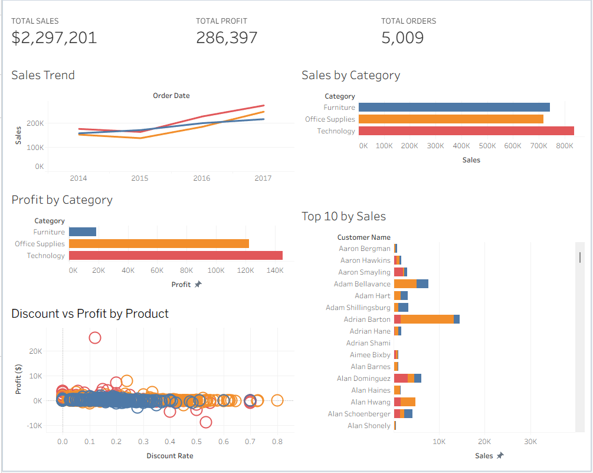

# Retail Sales Performance Dashboard (Tableau)

## Project Overview
This project analyzes retail sales performance using Tableau. 
The dashboard provides insights into sales trends, profitability, customer performance, and the impact of discounts on product profitability.

## Dashboard Features
• KPI metrics: Total Sales, Total Profit, Total Orders  
• Sales Trend over time  
• Sales by Category  
• Profit by Category  
• Top Customers by Sales  
• Discount vs Profit analysis by product  

## Tools Used
• Tableau  
• CSV dataset (Sample Superstore)  
• Data visualization  

## Dashboard Preview

